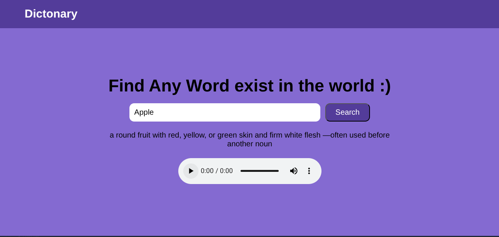

# 📖 Dictionary App

A simple and interactive **dictionary web app** built using **HTML, CSS, and JavaScript**, powered by a dictionary API.

## 🔍 Features

- ✅ **Word Search** – Users can search for any English word.
- 📚 **Meaning & Definition** – Get the meaning, definition, and part of speech of the word.
- 🔊 **Word Pronunciation** – Listen to the correct pronunciation using built-in audio.
- 🤔 **"Did you mean?" Suggestions** – In case the word doesn't exist, the app provides similar word suggestions.
- 🌐 **API Integrated** – Fetches real-time data from an external dictionary API.

## 📸 Screenshot

                                                     
                                                                                                                            
                                                                                                                            
